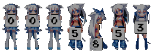
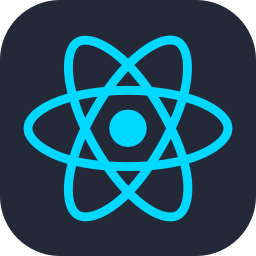

<h1>Hi, I'm @qaqms</h1>

 
  
喜欢二次元 · 专注于 N.E.K.O. 插件

 

<table width="100%">
<tr>
<td width="37%" valign="top">
<h3>Languages</h3>

&nbsp;

<h3>Frameworks & Tools</h3>

&nbsp;
&nbsp;
&nbsp;

Python / TypeScript / TSX pytest / Ruff / GitHub Actions

</td>
<td width="63%" valign="top">
<picture><source media="(prefers-color-scheme: dark)" srcset="./assets/dashboard-dark.svg" /></picture>
</td>
</tr>
<tr>
<td valign="top">
<h3>A Little About Me</h3>
<ul>
<li>喜欢二次元</li>
<li>专注于 N.E.K.O. 插件</li>
</ul>

<a href="https://github.com/qaqms?tab=repositories">All repositories</a>

</td>
<td valign="top">
<picture><source media="(prefers-color-scheme: dark)" srcset="./assets/language-orbit-dark.svg" /></picture>
</td>
</tr>
</table>

<h2>Contribution Landscape</h2>

<picture><source media="(prefers-color-scheme: dark)" srcset="./assets/landscape-dark.svg" /></picture>

Public GitHub snapshot · 语言比例按源码字节统计 · 数据日期见图表

qaqms / CODE & LITTLE WORLDS

