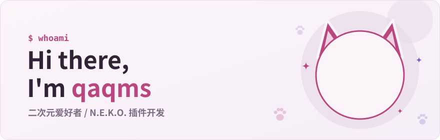
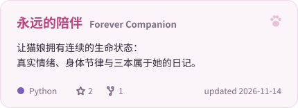
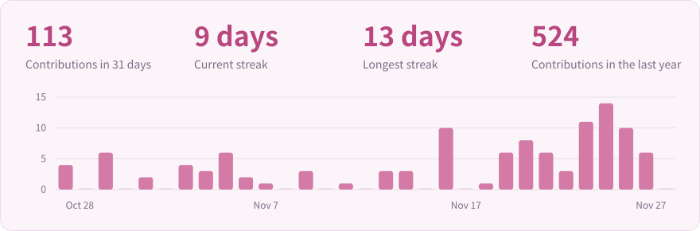
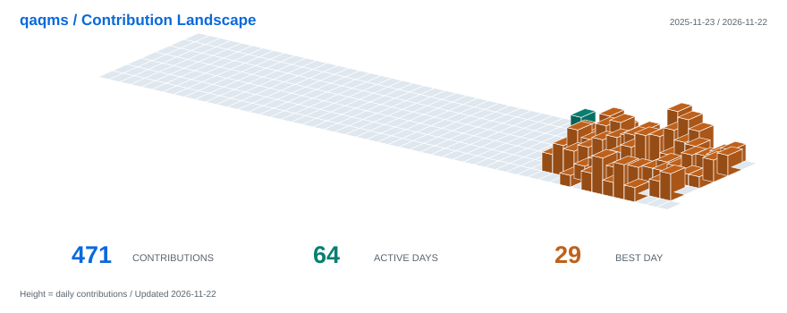

<picture>
  <source media="(max-width: 650px) and (prefers-color-scheme: dark)" srcset="./assets/hero-mobile-dark.svg" />
  <source media="(max-width: 650px)" srcset="./assets/hero-mobile-light.svg" />
  <source media="(prefers-color-scheme: dark)" srcset="./assets/hero-dark.svg" />
  
</picture>

  <a href="https://github.com/qaqms"><picture><source media="(prefers-color-scheme: dark)" srcset="https://img.shields.io/badge/GitHub-3D2F45?style=flat&amp;logo=github&amp;logoColor=F4A6CD" /></picture></a>
  <a href="https://github.com/qaqms?tab=repositories&q=n.e.k.o_plugin"><picture><source media="(prefers-color-scheme: dark)" srcset="https://img.shields.io/badge/N.E.K.O.%20Plugins-3D2F45?style=flat&amp;logo=github&amp;logoColor=F4A6CD" /></picture></a>
  <a href="https://github.com/qaqms?tab=repositories"><picture><source media="(prefers-color-scheme: dark)" srcset="https://img.shields.io/badge/Repositories-3D2F45?style=flat&amp;logo=bookstack&amp;logoColor=F4A6CD" /></picture></a>

> 喜欢二次元，专注于给 **N.E.K.O.** 写插件，让陪在身边的猫娘更像一个真正生活着的她。

## Featured projects

  <a href="https://github.com/qaqms/n.e.k.o_plugin_forever_companion"><picture><source media="(prefers-color-scheme: dark)" srcset="./assets/project-n.e.k.o_plugin_forever_companion-dark.svg" /></picture></a>
  <a href="https://github.com/qaqms/n.e.k.o_plugin_love_with_you"><picture><source media="(prefers-color-scheme: dark)" srcset="./assets/project-n.e.k.o_plugin_love_with_you-dark.svg" /></picture></a>
  <a href="https://github.com/qaqms/n.e.k.o_plugin_sticker_manager"><picture><source media="(prefers-color-scheme: dark)" srcset="./assets/project-n.e.k.o_plugin_sticker_manager-dark.svg" /></picture></a>
  <a href="https://github.com/qaqms/mcbot"><picture><source media="(prefers-color-scheme: dark)" srcset="./assets/project-mcbot-dark.svg" /></picture></a>

## GitHub at a glance

<picture>
  <source media="(prefers-color-scheme: dark)" srcset="./assets/overview-dark.svg" />
  
</picture>

## Contribution activity

<picture>
  <source media="(prefers-color-scheme: dark)" srcset="./assets/activity-dark.svg" />
  
</picture>

## Skills &amp; technologies

  <picture><source media="(prefers-color-scheme: dark)" srcset="https://img.shields.io/badge/Python-3D2F45?style=flat&amp;logo=python&amp;logoColor=F4A6CD" /></picture>
  <picture><source media="(prefers-color-scheme: dark)" srcset="https://img.shields.io/badge/TypeScript-3D2F45?style=flat&amp;logo=typescript&amp;logoColor=F4A6CD" /></picture>
  <picture><source media="(prefers-color-scheme: dark)" srcset="https://img.shields.io/badge/JavaScript-3D2F45?style=flat&amp;logo=javascript&amp;logoColor=F4A6CD" /></picture>
  <picture><source media="(prefers-color-scheme: dark)" srcset="https://img.shields.io/badge/React-3D2F45?style=flat&amp;logo=react&amp;logoColor=F4A6CD" /></picture>
  <picture><source media="(prefers-color-scheme: dark)" srcset="https://img.shields.io/badge/Java-3D2F45?style=flat&amp;logo=openjdk&amp;logoColor=F4A6CD" /></picture>
  <picture><source media="(prefers-color-scheme: dark)" srcset="https://img.shields.io/badge/SQLite-3D2F45?style=flat&amp;logo=sqlite&amp;logoColor=F4A6CD" /></picture>
  <picture><source media="(prefers-color-scheme: dark)" srcset="https://img.shields.io/badge/pytest-3D2F45?style=flat&amp;logo=pytest&amp;logoColor=F4A6CD" /></picture>
  <picture><source media="(prefers-color-scheme: dark)" srcset="https://img.shields.io/badge/Ruff-3D2F45?style=flat&amp;logo=ruff&amp;logoColor=F4A6CD" /></picture>
  <picture><source media="(prefers-color-scheme: dark)" srcset="https://img.shields.io/badge/Git-3D2F45?style=flat&amp;logo=git&amp;logoColor=F4A6CD" /></picture>
  <picture><source media="(prefers-color-scheme: dark)" srcset="https://img.shields.io/badge/GitHub%20Actions-3D2F45?style=flat&amp;logo=githubactions&amp;logoColor=F4A6CD" /></picture>
  <picture><source media="(prefers-color-scheme: dark)" srcset="https://img.shields.io/badge/Blender-3D2F45?style=flat&amp;logo=blender&amp;logoColor=F4A6CD" /></picture>

## Profile details

<picture>
  <source media="(prefers-color-scheme: dark)" srcset="./assets/terminal-dark.svg" />
  
</picture>

  
Contribution landscape

<picture>
  <source media="(prefers-color-scheme: dark)" srcset="./assets/landscape-dark.svg" />
  
</picture>

  
   
  qaqms / CODE &amp; LITTLE WORLDS · 卡片由 GitHub Actions 每日刷新

