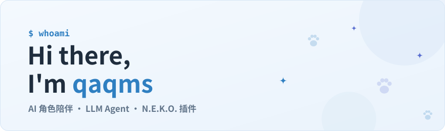
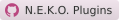
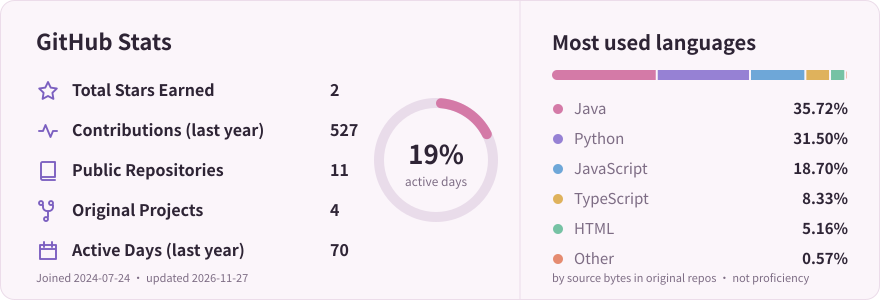
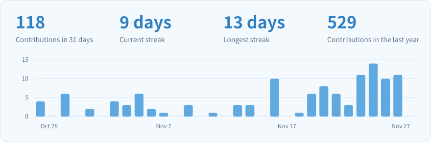
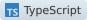

<picture>
  <source media="(max-width: 650px) and (prefers-color-scheme: dark)" srcset="./assets/banner-mobile-dark.svg" />
  <source media="(max-width: 650px)" srcset="./assets/banner-mobile-light.svg" />
  <source media="(prefers-color-scheme: dark)" srcset="./assets/banner-dark.svg" />
  
</picture>

  <a href="https://github.com/qaqms"><picture><source media="(prefers-color-scheme: dark)" srcset="./assets/badge-github-dark.svg" /></picture></a>
  <a href="https://github.com/qaqms?tab=repositories&q=n.e.k.o_plugin"><picture><source media="(prefers-color-scheme: dark)" srcset="./assets/badge-n-e-k-o-plugins-dark.svg" /></picture></a>
  <a href="https://github.com/qaqms?tab=repositories"><picture><source media="(prefers-color-scheme: dark)" srcset="./assets/badge-repositories-dark.svg" /></picture></a>

> 喜欢二次元，专注于给 **N.E.K.O.** 写插件，让陪在身边的猫娘更像一个真正生活着的她。

## GitHub at a glance

<picture>
  <source media="(prefers-color-scheme: dark)" srcset="./assets/stats-dark.svg" />
  
</picture>

## Contribution activity

<picture>
  <source media="(prefers-color-scheme: dark)" srcset="./assets/recent-dark.svg" />
  
</picture>

## Skills &amp; technologies

  <picture><source media="(prefers-color-scheme: dark)" srcset="./assets/badge-python-dark.svg" /></picture>
  <picture><source media="(prefers-color-scheme: dark)" srcset="./assets/badge-typescript-dark.svg" /></picture>
  <picture><source media="(prefers-color-scheme: dark)" srcset="./assets/badge-javascript-dark.svg" /></picture>
  <picture><source media="(prefers-color-scheme: dark)" srcset="./assets/badge-react-dark.svg" /></picture>
  <picture><source media="(prefers-color-scheme: dark)" srcset="./assets/badge-java-dark.svg" /></picture>
  <picture><source media="(prefers-color-scheme: dark)" srcset="./assets/badge-sqlite-dark.svg" /></picture>
  <picture><source media="(prefers-color-scheme: dark)" srcset="./assets/badge-pytest-dark.svg" /></picture>
  <picture><source media="(prefers-color-scheme: dark)" srcset="./assets/badge-ruff-dark.svg" /></picture>
  <picture><source media="(prefers-color-scheme: dark)" srcset="./assets/badge-git-dark.svg" /></picture>
  <picture><source media="(prefers-color-scheme: dark)" srcset="./assets/badge-github-actions-dark.svg" /></picture>
  <picture><source media="(prefers-color-scheme: dark)" srcset="./assets/badge-blender-dark.svg" /></picture>

## Profile details

<picture>
  <source media="(prefers-color-scheme: dark)" srcset="./assets/terminal-dark.svg" />
  
</picture>

  
Contribution landscape

<picture>
  <source media="(prefers-color-scheme: dark)" srcset="./assets/landscape-dark.svg" />
  
</picture>

  
   
  qaqms / CODE &amp; LITTLE WORLDS · 卡片由 GitHub Actions 每日刷新

